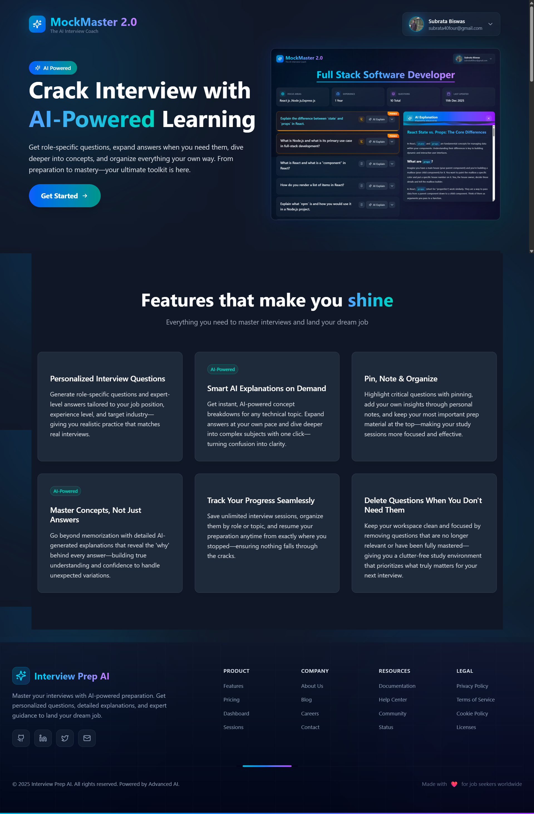
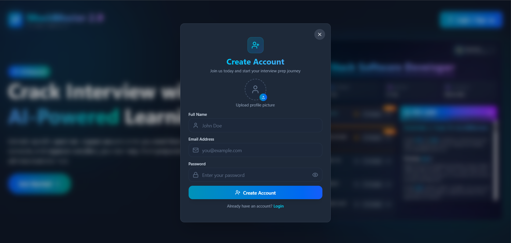
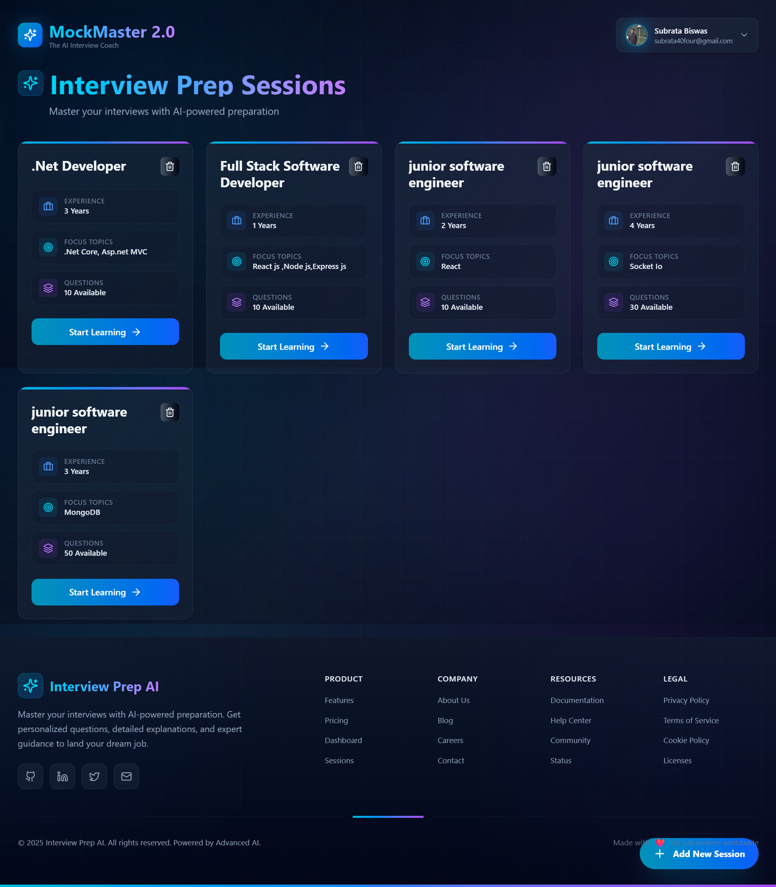
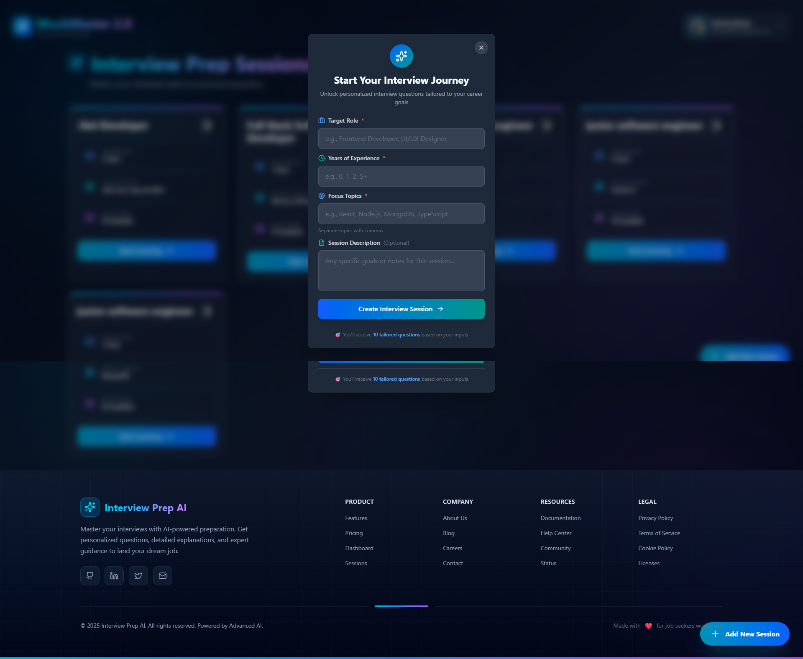
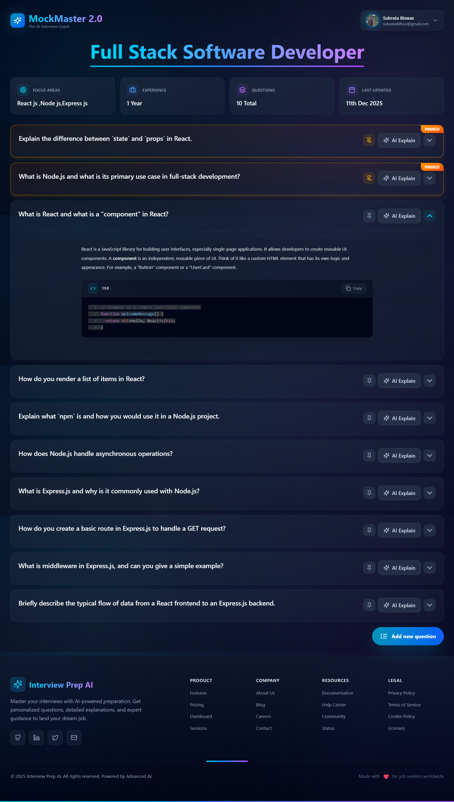

# MockMaster 2.0 – AI-Powered Interview Coach

MockMaster 2.0 is an AI-driven interview preparation platform that helps candidates practice role-specific technical interviews with intelligently generated questions, beginner‑friendly explanations, and organized practice sessions.

Built with a modern React frontend and a Node.js/Express backend, MockMaster 2.0 integrates Google Gemini for AI question generation and explanations, uses JWT-based authentication, and stores media assets on Cloudinary.

---

## Table of Contents

- [Features](#features)
- [Tech Stack](#tech-stack)
- [Architecture Overview](#architecture-overview)
- [Screenshots](#screenshots)
- [Getting Started](#getting-started)
  - [Prerequisites](#prerequisites)
  - [Environment Variables](#environment-variables)
  - [Installation](#installation)
  - [Running the App](#running-the-app)
- [Core Functionality](#core-functionality)
  - [Authentication Flow](#authentication-flow)
  - [AI-Powered Question Generation](#ai-powered-question-generation)
  - [Interview Sessions](#interview-sessions)
  - [AI Explanations](#ai-explanations)
- [API Overview](#api-overview)
- [Project Structure](#project-structure)
- [Security & Best Practices](#security--best-practices)
- [Future Improvements](#future-improvements)
- [License](#license)

---

## Features

- **Modern Landing Page**  
  Clean, responsive landing page with clear call‑to‑action and feature highlights.

- **Secure Authentication**
  - Sign up with email, password, and optional profile image
  - Email verification via OTP for new accounts
  - Login with secure cookie-based JWT authentication
  - Password reset flow with email OTP and enforced password rules

- **AI-Powered Interview Prep**
  - Role and experience-specific question generation using Google Gemini
  - Focus topic customization (e.g., “React, Node.js, TypeScript”)
  - Beginner‑friendly answers with optional code snippets

- **Session Management**
  - Create and persist interview prep sessions
  - View all sessions in a dashboard
  - Delete sessions (with confirmation) when no longer needed

- **Question Management**
  - View all questions for a session
  - Pin/unpin important questions (pinned questions float to the top)
  - Add new AI-generated questions to existing sessions
  - Attach personal notes to questions (backend support)

- **AI Explanations**
  - “AI Explain” for deep-dive explanations of any question
  - Markdown rendering for rich text, code blocks, tables, and links
  - Syntax highlighting and copy-to-clipboard for code snippets

- **Polished UI/UX**
  - Tailwind CSS-based design with gradients, glassmorphism, and smooth animations
  - Mobile‑responsive layouts
  - Toast notifications for feedback (success/error/loading states)

---

## Tech Stack

**Frontend**

- React
- Redux Toolkit (global state management)
- React Router
- Tailwind CSS
- Axios
- React Markdown + remark-gfm
- react-syntax-highlighter
- Framer Motion
- react-hot-toast
- lucide-react / react-icons

**Backend**

- Node.js
- Express
- MongoDB + Mongoose
- JWT (JSON Web Tokens)
- bcrypt (password hashing)
- Multer (file uploads)
- Cloudinary (image hosting)
- Nodemailer (email OTPs)
- Google Gemini (via `@google/genai`)

---

## Architecture Overview

MockMaster 2.0 is a full‑stack application following a clear separation of concerns:

- **Frontend (SPA)**  
  Handles UI, routing, and client-side state. Communicates with the backend via RESTful APIs and uses secure cookies (`withCredentials: true`) for authentication.

- **Backend (API server)**  
  Provides REST endpoints for:
  - Authentication & user management
  - AI-based question generation & explanation
  - Session & question CRUD
  - OTP-based flows (sign up and password reset)

- **Database (MongoDB)**  
  Three primary collections:
  - `User`: credentials, profile, email verification & OTP metadata
  - `Session`: interview session metadata and question references
  - `Question`: individual questions, answers, notes, and pin status

- **External Services**
  - **Cloudinary** for profile image storage
  - **Gmail SMTP (Nodemailer)** for email OTPs
  - **Google Gemini** for question generation and concept explanations

---

## Screenshots

All screenshots are stored in `mockmaster/frontend/public`.

> Adjust the relative paths if your folder structure is different.

### Landing Page



### Create Account



### Dashboard



### Create Session



### Interview Preparation View



---

## Getting Started

### Prerequisites

- **Node.js** (LTS recommended)
- **npm or yarn**
- **MongoDB instance** (local or hosted)
- **Cloudinary account**
- **Gmail account + App Password**
- **Google Gemini API key**

### Environment Variables

Create a `.env` file in your backend root with:
Server
```bash
PORT=5000
MONGODB_URI=your_mongodb_connection_string
JWT_SECRET_KEY=your_jwt_secret_key
```

Google Gemini
```bash
GEMINI_API_KEY=your_gemini_api_key
```

Cloudinary
```bash
CLOUDINARY_CLOUD_NAME=your_cloudinary_cloud_name
CLOUDINARY_API_KEY=your_cloudinary_api_key
CLOUDINARY_API_SECRET=your_cloudinary_api_secret
```

Email (Gmail)
```bash
EMAIL=your_gmail_address
APP_PASSWORD=your_gmail_app_password
```

For the frontend, configure the API base URL (In `App.jsx`):
`export const serverUrl = "http://localhost:5000"; // or your deployed API URL
Ensure CORS is configured on the backend to allow credentials from your frontend origin.`

### Installation

Clone the repository and install dependencies for both frontend and backend.
Clone
```bash
git clone https://github.com/subrata-24/mockmaster.git
cd mockmaster
```

Backend
```bash
cd backend
npm install
```

Frontend
```bash
cd ../frontend
npm install
```

### Running the App

In two separate terminals:

Backend (from /backend)
```bash
npm run dev # or npm start
```

Frontend (from /frontend)
```bash
npm run dev
```

Visit:

- Frontend: `http://localhost:5173` (or the port your dev server uses)
- Backend: `http://localhost:5000`

---

## Core Functionality

### Authentication Flow

- **Sign Up**
  - User submits name, email, password, and optional profile picture.
  - Backend:
    - Hashes password with bcrypt
    - Uploads image to Cloudinary (if provided)
    - Creates user document
    - Generates JWT and sets it as an httpOnly cookie
    - Generates 4‑digit OTP (expires in 2 minutes) and sends via email

- **Email Verification (Sign Up OTP)**
  - User enters OTP in the frontend.
  - Backend:
    - Validates OTP and expiry
    - Marks `isEmailVerified = true`
    - Clears OTP fields

- **Login**
  - User submits email and password.
  - Backend:
    - Validates credentials and email verification
    - Issues JWT and stores it as an httpOnly cookie
    - Returns non-sensitive user data (no password)

- **Forgot Password**
  - User enters email to request reset OTP.
  - Backend sends reset OTP (2‑minute expiry).
  - User verifies OTP, then sets a new password.
  - Backend hashes the new password and logs user in automatically by issuing a new JWT.

- **Current User**
  - Frontend hook (`useGetCurrentUser`) calls `/api/user/get-current-user` on app load.
  - If valid token exists and email is verified, Redux `userData` is hydrated.

### AI-Powered Question Generation

- Route: `POST /api/ai/question-answer`
- Request body:
  - `role`
  - `experience`
  - `topicsToFocus`
  - `numberOfQuestions`
- Backend:
  - Builds a strongly structured prompt (`questionAnswerPrompt`)
  - Calls Google Gemini (`gemini-2.5-flash`)
  - Strips markdown fences from the response
  - Parses JSON into an array of `{ question, answer }`
- Frontend:
  - Uses this to create a new session or add more questions to existing sessions.

### Interview Sessions

- **Create Session**
  - Frontend: `CreateSession` form collects:
    - Role
    - Experience (numeric)
    - Topics to focus on
    - Optional description
  - Backend:
    - Creates `Session` document (linked to authenticated user)
    - Creates associated `Question` documents
    - Stores question IDs in `session.questions`

- **List Sessions**
  - Route: `GET /api/session/get-all-sessions`
  - Returns all sessions for logged-in user, sorted by creation date (newest first).
  - Rendered as cards on the Dashboard.

- **Delete Session**
  - Route: `DELETE /api/session/delete-session-by-id/:id`
  - Deletes all questions belonging to that session and then the session itself.
  - Only the session owner can delete (authorization check).

### AI Explanations

- Triggered via "AI Explain" button on each question.
- Route: `POST /api/ai/question-explanation`
- Backend:
  - Builds explanation prompt (`conceptExplainPrompt`)
  - Uses Gemini to generate a JSON object: `{ title, explanation }`
  - Explanation is markdown-formatted text.

- Frontend:
  - Renders explanation in a sticky sidebar using `ReactMarkdown`.
  - Supports:
    - Headings
    - Lists
    - Blockquotes
    - Tables
    - Links
    - Syntax-highlighted code blocks (with copy button)

---

## API Overview

> Route names may vary slightly depending on your final routing setup; adjust as needed.

**Auth**

- `POST /api/auth/sign-up`
- `POST /api/auth/resend-signup-otp`
- `POST /api/auth/verify-signup-otp`
- `POST /api/auth/login`
- `GET  /api/auth/sign-out`
- `POST /api/auth/forget-password-otp`
- `POST /api/auth/verify-forget-otp`
- `POST /api/auth/confirm-password`

**User**

- `GET /api/user/get-current-user`

**AI**

- `POST /api/ai/question-answer`
- `POST /api/ai/question-explanation`

**Sessions**

- `POST /api/session/create-session`
- `GET  /api/session/get-all-sessions`
- `GET  /api/session/get-session-by-id/:id`
- `DELETE /api/session/delete-session-by-id/:id`

**Questions**

- `POST /api/question/add-question`
- `POST /api/question/:id/pin`
- `POST /api/question/:id/add-note`

---

## Security & Best Practices

- **Password Hashing**
  - Bcrypt with salt and adequate work factor
- **JWT Security**
  - Tokens signed with secret key
  - Set as httpOnly cookies to mitigate XSS
  - `sameSite: "strict"` to reduce CSRF risk
- **OTP Handling**
  - Time‑limited (2 minutes)
  - Cleared after verification
- **File Uploads**
  - Temporary storage with Multer
  - Uploaded to Cloudinary
  - Local file removed after upload
- **Input Validation**
  - Basic server-side checks for required fields
  - Frontend validation for email/password
---

## Future Improvements

- Role-based access control (e.g., admin dashboards)
- Rich note-taking system for each question
- Export sessions/questions to PDF or Markdown
- More granular tagging and filtering for questions (difficulty, topic)
- Internationalization (i18n)
- Dark/light theme toggle

---

## License

This project is currently closed-source/personal.  
---


